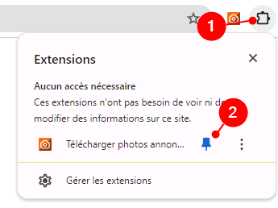
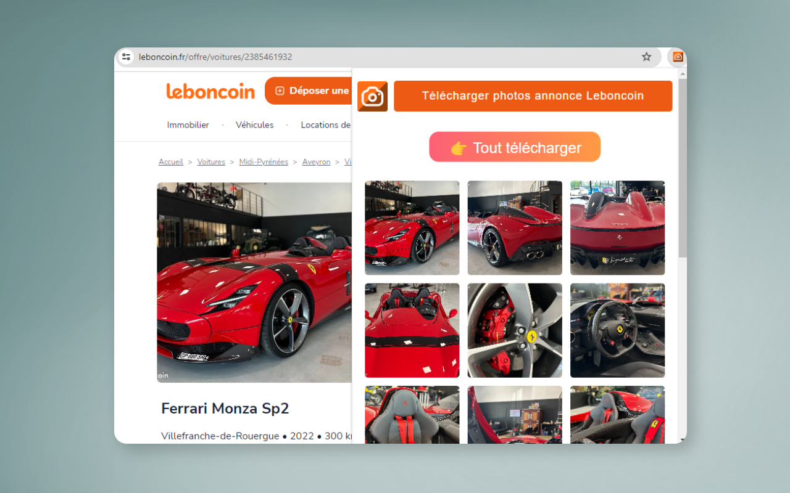

# Qu'est-ce que l'extension "Télécharger photos annonce Leboncoin" ?

**Télécharger photos annonce Leboncoin** est une extension pour navigateur Google Chrome, Microsoft Edge, Vivaldi, qui permet de télécharger en un clic les images d'une annonce Leboncoin.

# Installation

L'extension **Télécharger photos annonce Leboncoin** est disponible sur les navigateurs suivants : 

* [Google Chrome](https://chromewebstore.google.com/detail/t%C3%A9l%C3%A9charger-photos-annonc/bghlaihhogfmfmkgcehemfokfkanjbjb?hl=fr)
* [Vivaldi (Chrome Web Store)](https://chromewebstore.google.com/detail/t%C3%A9l%C3%A9charger-photos-annonc/bghlaihhogfmfmkgcehemfokfkanjbjb?hl=fr)

# Utilisation

Après avoir installé l'extension, affichez-la dans votre barre :

Pour que l'extension affiche le bouton de téléchargement ainsi que les photos, vous devez vous rendre sur une annonce Leboncoin.

Vous avez la possibilité de visualiser et de cliquer sur chacune des photos de l'annonce.

Le bouton **Tout télécharger** vous permet de télécharger l'ensemble des photos de l'annonce dans un fichier ZIP.

# Feedback

Si vous rencontrez un problème avec l'extension, ou que vous souhaitez une évolution, n'hésitez pas à créer une *issue* ou à me contacter sur [Twitter/X](https://twitter.com/shevabam) !

# Politique de confidentialité

L'extension ne collecte aucune information sur l'utilisateur ou d'autres informations.